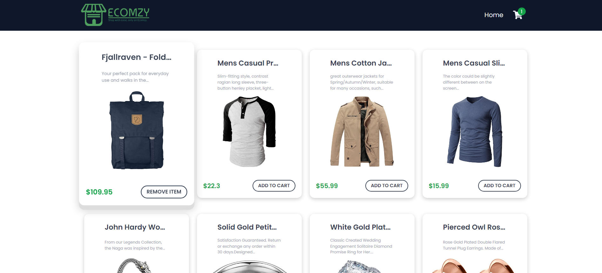

# Shopping Cart App

This is an app built using ReactJS with Redux toolkit used for state management , it gets data of items from API.

## Preview



### Commands To Run To Install Dependencies

```bash
npm install 
```

### To Run This Code
```bash
npm run start
```